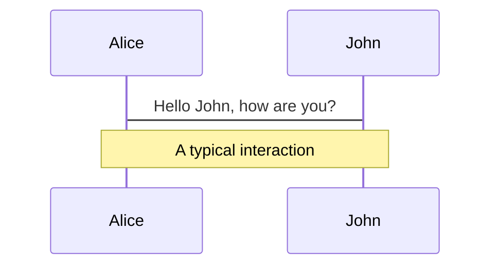
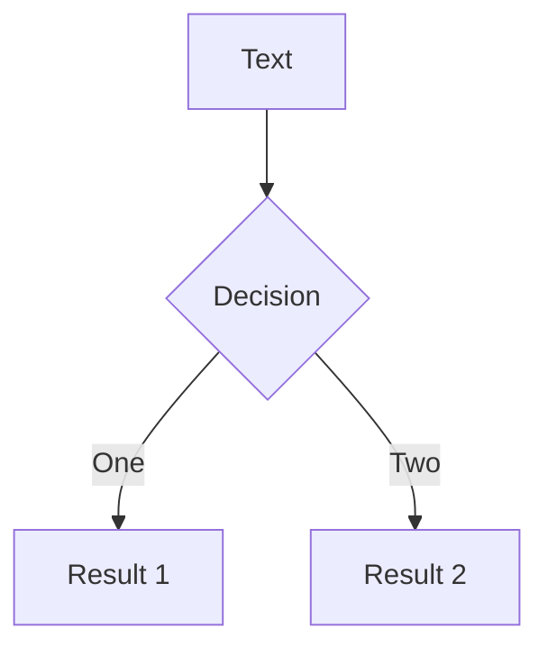
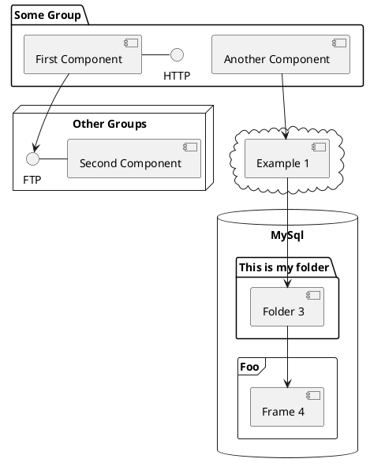

# 前端大容量存储方案-IndexedDB

[IndexDB](https://www.w3.org/TR/IndexedDB/)

<div class="pt-12">
  <span @click="$slidev.nav.next" class="px-2 py-1 rounded cursor-pointer" hover="bg-white bg-opacity-10">
    Press Space for next page <carbon:arrow-right class="inline"/>
  </span>
</div>

<div class="abs-br m-6 flex gap-2">
  <button @click="$slidev.nav.openInEditor()" title="Open in Editor" class="text-xl icon-btn opacity-50 !border-none !hover:text-white">
    <carbon:edit />
  </button>
  <a href="https://github.com/slidevjs/slidev" target="_blank" alt="GitHub"
    class="text-xl icon-btn opacity-50 !border-none !hover:text-white">
    <carbon-logo-github />
  </a>
</div>

<!--
The last comment block of each slide will be treated as slide notes. It will be visible and editable in Presenter Mode along with the slide. [Read more in the docs](https://sli.dev/guide/syntax.html#notes)xx
-->

---

<Title>What is IndexDB?</Title>

> IndexedDB 是一种底层 API，用于在客户端存储大量的结构化数据（也包括文件/二进制大型对象（blobs））。该 API 使用索引实现对数据的高性能搜索。[^1]

<br/>
<br/>

|      | 会话期 Cookie | 持久性 Cookie | sessionStorage | localStorage | indexDB | WebSQL |
| ---- | ---- | ---- | ---- | ---- | ---- | ---- |
| 存储大小 | 4kb | 4kb | 2.5 ～ 10M | 2.5 ～ 10M | >100M | 已废弃 |
| 失效时间 | 浏览器关闭 | 设置过期时间 | 浏览器关闭 | 手动清理 | 手动清理 | 已废弃 |
| 与服务端交互 | 有 | 有 | 无 | 无 | 无 | 已废弃 |
| 访问策略 | 同源策略 | 同源策略 | 同源策略 | 同源策略 | 同源策略 | 已废弃 |

[^1]: [查看文档](https://developer.mozilla.org/zh-CN/docs/Web/API/IndexedDB_API)

---

<Title>IndexedDB 特点</Title>

- 📝 **非关系型数据库(NoSql)** - 我们都知道 MySQL 等数据库都是关系型数据库，它们的主要特点就是数据都以一张二维表的形式存储，而 IndexedDB 是非关系型数据库，主要以键值对的形式存储数据。

<v-clicks>

- 🎨 **持久化存储** - cookie、localStorage、sessionStorage 等方式存储的数据当我们清楚浏览器缓存后，这些数据都会被清除掉的，而使用 IndexedDB 存储的数据则不会，除非手动删除该数据库。

- 🧑‍💻 **异步操作** - IndexedDB 操作时不会锁死浏览器，用户依然可以进行其他的操作，这与 localStorage 形成鲜明的对比，后者是同步的。

- 🎥 **同源策略** - IndexedDB 同样存在同源限制，每个数据库对应创建它的域名。网页只能访问自身域名下的数据库，而不能访问跨域的数据库。

- 📤 **存储容量大** - 这也是 IndexedDB 最显著的特点之一了，这也是不用 localStorage 等存储方式的最好理由。

- 🤹 **支持事务** - IndexedDB 支持事务(transaction)，这意味着一系列的操作步骤之中，只要有一步失败了，整个事务都会取消，数据库回滚的事务发生之前的状态，这和 MySQL 等数据库的事务类似。

</v-clicks>
---

<Title>IndexedDB 核心概念</Title>

- 🛢 **IDBDatabase**： 表示数据库对象，在操作 indexedDB 之前，我们必须指定数据库。

<br/>

<v-click>

- 📊 **IDBObjectStore**：表示对象仓库，类似关系型数据库的表。

</v-click>

<br/>

<v-click>

- 👣 **IDBRequest**：操作请求对象，indexedDB 每个操作都是异步的，也就是说每个请求会先返回这个这个对象，然后根据这个对象的回调去进行后续的处理。

</v-click>

<br/>

<v-click>

- 👆︎ **IDBCursor**：游标对象，主要用来遍历数据。

</v-click>

<br/>

<v-click>

- 📇 **IDBIndex**：索引，索引主要用来加快数据查询的效率，但同时会增加存储的占用，本质上是一种空间换时间的方式。

</v-click>

<br/>

<v-click>

- 🗃️ **IDBKeyRange**：索引范围对象，主要用来批量查询数据，或者批量删除数据的时候使用。

</v-click>

<br/>

<v-click>

- 💼 **IDBTransaction**：indexedDB 的所有操作都是基于事务的，事务具有 ACID 四大特性。

</v-click>

---
# IndexedDB 核心概念

---

<Title>IDBDatabase</Title>

---

<Title>事务的四大特性</Title>

> 事务是一系列操作组成的工作单元，该工作单元内的操作是不可分割的，即要么所有操作都做，要么所有操作都不做，这就是事务。

<br/>

- **原子性（Atomicity）**：事务是一个不可分割的工作单位，事务中的操作要么全部成功，要么全部失败。

<br/>

<v-click>

- **一致性（Consistency）**：事务必须使数据库从一个一致性状态变换到另外一个一致性状态。

</v-click>

<br/>

<v-click>

- **隔离性（Isolation）**：多个用户并发访问数据库时，数据库为每一个用户开启的事务，不能被其他事务的操作数据所干扰，多个并发事务之间要相互隔离。

</v-click>

<br/>

<v-click>

- **持久性（Durability）**：一个事务一旦被提交，它对数据库中数据的改变就是永久性的，接下来即使数据库发生故障也不应该对其有任何影响。

</v-click>

---

<Title>IndexDB 的容量到底有多大？</Title>

<div v-click-hide>

> 取决于浏览器和磁盘空间。

以 Chrome 为例，根据 [Chrome 官方文档](https://developer.chrome.com/docs/apps/offline_storage/#table)描述，持久性存储（Persistent storage）的最大容量就是硬盘上的可用空间大小。

| | Temporary storage | Persistent storage | Unlimited storage |
| ---- | ---- | ---- | ---- |
|...|...|...|...|
| Maximum storage space | Up to 20% of the shared pool. | As large as the available space on the hard drive. It has no fixed pool of storage. | As large as the available space on the hard drive. |
|...|...|...|...|

</div>

<v-after>

[chromium 源码](https://chromium.googlesource.com/chromium/src/+/refs/heads/master/storage/browser/quota/quota_settings.cc#130)

```c {all|14|3-6}
// Pool size calculated by ratio.
int64_t pool_size_by_ratio = total * kTemporaryPoolSizeRatio;
  int64_t pool_size =
      kTemporaryPoolSizeFixed > 0
          ? std::min(kTemporaryPoolSizeFixed, pool_size_by_ratio)
          : pool_size_by_ratio;
  settings.pool_size = pool_size;
  settings.should_remain_available =
      std::min(kShouldRemainAvailableFixed,
               static_cast<int64_t>(total * kShouldRemainAvailableRatio));
  settings.must_remain_available =
      std::min(kMustRemainAvailableFixed,
               static_cast<int64_t>(total * kMustRemainAvailableRatio));
  settings.per_host_quota = pool_size * kPerHostTemporaryRatio;
  settings.session_only_per_host_quota = std::min(
      RandomizeByPercent(kMaxSessionOnlyHostQuota, kRandomizedPercentage),
      static_cast<int64_t>(settings.per_host_quota *
                           kSessionOnlyHostQuotaRatio));
  settings.refresh_interval = base::Seconds(60);
```

</v-after>

<style>
.slidev-vclick-hidden {
  display: none;
}
</style>

---
layout: image-left
image: https://source.unsplash.com/collection/94734566/1920x1080
---

<Title>Code</Title>

Use code snippets and get the highlighting directly![^1]

```ts {all|2|1-6|9|all}
interface User {
  id: number
  firstName: string
  lastName: string
  role: string
}

function updateUser(id: number, update: User) {
  const user = getUser(id)
  const newUser = {...user, ...update}
  saveUser(id, newUser)
}
```

<arrow v-click="3" x1="400" y1="420" x2="230" y2="330" color="#564" width="3" arrowSize="1" />

[^1]: [Learn More](https://sli.dev/guide/syntax.html#line-highlighting)

<style>
.footnotes-sep {
  @apply mt-20 opacity-10;
}
.footnotes {
  @apply text-sm opacity-75;
}
.footnote-backref {
  display: none;
}
</style>

---

# Components

<div grid="~ cols-2 gap-4">
<div>

You can use Vue components directly inside your slides.

We have provided a few built-in components like `<Tweet/>` and `<Youtube/>` that you can use directly. And adding your custom components is also super easy.

```html
<Counter :count="10" />
```

<!-- ./components/Counter.vue -->
<Counter :count="10" m="t-4" />

Check out [the guides](https://sli.dev/builtin/components.html) for more.

</div>
<div>

```html
<Tweet id="1390115482657726468" />
```

<Tweet id="1390115482657726468" scale="0.65" />

</div>
</div>


---
class: px-20
---

# Themes

Slidev comes with powerful theming support. Themes can provide styles, layouts, components, or even configurations for tools. Switching between themes by just **one edit** in your frontmatter:

<div grid="~ cols-2 gap-2" m="-t-2">

```yaml
---
theme: default
---
```

```yaml
---
theme: seriph
---
```


</div>

Read more about [How to use a theme](https://sli.dev/themes/use.html) and
check out the [Awesome Themes Gallery](https://sli.dev/themes/gallery.html).

---
preload: false
---

# Animations

Animations are powered by [@vueuse/motion](https://motion.vueuse.org/).

```html
<div
  v-motion
  :initial="{ x: -80 }"
  :enter="{ x: 0 }">
  Slidev
</div>
```

<div class="w-60 relative mt-6">
  <div class="relative w-40 h-40">
    
    
    
  </div>

  <div
    class="text-5xl absolute top-14 left-40 text-[#2B90B6] -z-1"
    v-motion
    :initial="{ x: -80, opacity: 0}"
    :enter="{ x: 0, opacity: 1, transition: { delay: 2000, duration: 1000 } }">
    Slidev
  </div>
</div>

<!-- vue script setup scripts can be directly used in markdown, and will only affects current page -->
<script setup lang="ts">
const final = {
  x: 0,
  y: 0,
  rotate: 0,
  scale: 1,
  transition: {
    type: 'spring',
    damping: 10,
    stiffness: 20,
    mass: 2
  }
}
</script>

<div
  v-motion
  :initial="{ x:35, y: 40, opacity: 0}"
  :enter="{ y: 0, opacity: 1, transition: { delay: 3500 } }">

[Learn More](https://sli.dev/guide/animations.html#motion)

</div>

---

# LaTeX

LaTeX is supported out-of-box powered by [KaTeX](https://katex.org/).

<br>

Inline $\sqrt{3x-1}+(1+x)^2$

Block
$$
\begin{array}{c}

\nabla \times \vec{\mathbf{B}} -\, \frac1c\, \frac{\partial\vec{\mathbf{E}}}{\partial t} &
= \frac{4\pi}{c}\vec{\mathbf{j}}    \nabla \cdot \vec{\mathbf{E}} & = 4 \pi \rho \\

\nabla \times \vec{\mathbf{E}}\, +\, \frac1c\, \frac{\partial\vec{\mathbf{B}}}{\partial t} & = \vec{\mathbf{0}} \\

\nabla \cdot \vec{\mathbf{B}} & = 0

\end{array}
$$

<br>

[Learn more](https://sli.dev/guide/syntax#latex)

---

# Diagrams

You can create diagrams / graphs from textual descriptions, directly in your Markdown.

<div class="grid grid-cols-3 gap-10 pt-4 -mb-6">







</div>

[Learn More](https://sli.dev/guide/syntax.html#diagrams)


---
layout: center
class: text-center
---

# Learn More

[Documentations](https://sli.dev) · [GitHub](https://github.com/slidevjs/slidev) · [Showcases](https://sli.dev/showcases.html)
