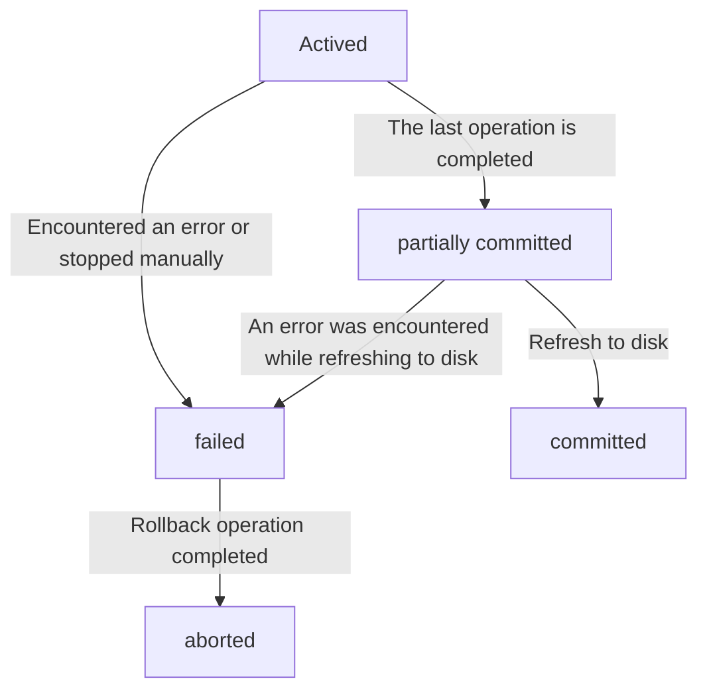

<Home />

---

# What is IndexedDB?

> IndexedDB 是一种底层 API，用于在客户端存储大量的结构化数据（也包括文件/二进制大型对象（blobs））。该 API 使用索引实现对数据的高性能搜索。[^1]

<br/>
<br/>

|      | 会话期 Cookie | 持久性 Cookie | sessionStorage | localStorage | IndexedDB | WebSQL |
| ---- | ---- | ---- | ---- | ---- | ---- | ---- |
| 存储大小 | 4kb | 4kb | 2.5 ～ 10M | 2.5 ～ 10M | >100M | 已废弃 |
| 失效时间 | 浏览器关闭 | 设置过期时间 | 浏览器关闭 | 手动清理 | 手动清理 | 已废弃 |
| 与服务端交互 | 有 | 有 | 无 | 无 | 无 | 已废弃 |
| 访问策略 | 同源策略 | 同源策略 | 同源策略 | 同源策略 | 同源策略 | 已废弃 |

[^1]: [查看文档](https://developer.mozilla.org/zh-CN/docs/Web/API/IndexedDB_API)

---

# IndexedDB 关键特性

- 📝 **非关系型数据库(NoSql)** - 我们都知道 MySQL 等数据库都是关系型数据库，它们的主要特点就是数据都以一张二维表的形式存储，而 <a style="color: red;" href="https://www.wikiwand.com/en/Object_database" target="_blank">IndexedDB 更像是非关系型数据库，</a> 主要以键值对的形式存储数据。

<v-clicks>

- 🎨 **持久化存储** - cookie、localStorage、sessionStorage 等方式存储的数据当我们清楚浏览器缓存后，这些数据都会被清除掉的，而使用 IndexedDB 存储的数据则不会，除非手动删除该数据库。

- 🧑‍💻 **异步操作** - IndexedDB 操作时不会锁死浏览器，用户依然可以进行其他的操作，这与 localStorage 形成鲜明的对比，后者是同步的。

- 🎥 **同源策略** - IndexedDB 同样存在同源限制，每个数据库对应创建它的域名。网页只能访问自身域名下的数据库，而不能访问跨域的数据库。

- 📤 **存储容量大** - 这也是 IndexedDB 最显著的特点之一了，这也是不用 localStorage 等存储方式的最好理由。

- 🤹 **支持事务** - IndexedDB 支持事务(transaction)，这意味着一系列的操作步骤之中，只要有一步失败了，整个事务都会取消，数据库回滚的事务发生之前的状态，这和 MySQL 等数据库的事务类似。

</v-clicks>

<style>
h1 {
  background-size: 100%;
  background-image: linear-gradient(45deg, #eea2a4 10%, #5c2223 20%);
  -webkit-background-clip: text;
  -moz-background-clip: text;
  -webkit-text-fill-color: transparent;
  -moz-text-fill-color: transparent;
}
</style>

---

# IndexedDB 核心概念

- 🛢 **IDBDatabase**： 表示数据库对象，通常包含一个或多个 ObjectStore。

<br/>

<v-click>

- 📊 **IDBObjectStore**：表示对象仓库，类似关系型数据库的表。

</v-click>

<br/>

<v-click>

- 👣 **IDBRequest**：操作请求对象，indexedDB 每个操作都是异步的，也就是说每个请求会先返回这个这个对象，然后根据这个对象的回调去进行后续的处理。

</v-click>

<br/>

<v-click>

- 👆︎ **IDBCursor**：游标对象，主要用来遍历数据。

</v-click>

<br/>

<v-click>

- 📇 **IDBIndex**：索引，索引主要用来加快数据查询的效率，但同时会增加存储的占用，本质上是一种空间换时间的方式。

</v-click>

<br/>

<v-click>

- 🗃️ **IDBKeyRange**：索引范围对象，主要用来批量查询数据，或者批量删除数据的时候使用。

</v-click>

<br/>

<v-click>

- 💼 **IDBTransaction**：indexedDB 的所有操作都是基于事务的，事务具有 ACID 四大特性。

</v-click>

---
layout: image-left
image: http://source.unsplash.com/collection/94734567/1920x1080
---

# [DataBase And Request](https://developer.mozilla.org/en-US/docs/Web/API/IndexedDB_API/Basic_Terminology#key_characteristics)

<IDBDatabase />

```javascript{monaco}
// IDBDatabase
const database = await openDB('admin', 1)

function openDB (name, version = 1) {
  return new Promise((resolve, reject) => {
    // IDBRequest
    const request = indexedDB.open(name, version)
    request.onsuccess = event => resolve(event.target.result)
    request.onerror = event => reject(event.target.errorCode)
    // IDBDatabaseException.UNKNOWN_ERR(1): 意外错误，无法归类。
    // IDBDatabaseException.NON_TRANSIENT_ERR(2): 操作不合法。
    // IDBDatabaseException.NOT_FOUND_ERR(3): 未发现要操作的数据库。
    // IDBDatabaseException.CONSTRAINT_ERR(4): 违反了数据库约束。
    // IDBDatabaseException.DATA_ERR(5): 提供给操作的数据不符合要求。
    // IDBDatabaseException.NOT_ALLOWED_ERR(6): 操作不合法。
    // IDBDatabaseException.TRANSACTION_INACTIVE_ERR(7): 试图重用已完成的事务。
    // IDBDatabaseException.ABORT_ERR(8): 请求中断。
    // IDBDatabaseException.READ_ONLY_ERR(9): 在 READ_ONLY 事务中尝试了更改操作。
    // IDBDatabaseException.TIMEOUT_ERR(10): 在有效时间内未完成操作。
    // IDBDatabaseException.QUOTA_ERR(11): 磁盘空间不足。
    // IDBDatabaseException.VER_ERR(12): 打开数据库的版本低于已有版本的请求。
  })
}
```

<style>
.footnotes-sep {
  @apply mt-20 opacity-10;
}
.footnotes {
  @apply text-sm opacity-75;
}
.footnote-backref {
  display: none;
}
</style>

---
layout: two-cols
---

<template v-slot:default>

# [扩展问题](https://html.spec.whatwg.org/multipage/webappapis.html#event-loops)

```javascript
console.log('start')

const button = document.getElementById('button')
button.addEventListener('click', () => {
  console.log('click')
})
button.click()

openIndexedDb()

setTimeout(() => console.log('setTimeout'), 0)

Promise.resolve('Promise').then(msg => {
  console.log(msg)
})

// 点击鼠标，触发 button 的点击事件
sleep(2000)

setTimeout(() => this.log("setTimeout2"), 0)

button.dispatchEvent(new Event('click'))

console.log('end')
```

</template>


<template v-slot:right>

# &nbsp;

<Event />

</template>

---
layout: image-left
image: http://source.unsplash.com/collection/94734568/1920x1080
equal: false
left: false
---

# [IDBObjectStore](https://developer.mozilla.org/en-US/docs/Web/API/IDBDatabase/createObjectStore)


```json
{
  id: 1,
  name: '张三',
  age: 18,
  avatar: 'http://source.unsplash.com/collection/94734566/32x32',
  phoneNumber: '156****0112',
  userName: 'zhangsan',
  password: '123456',
  ...
}
```

---

# [IDBObjectStore & IDBIndex](https://developer.mozilla.org/en-US/docs/Web/API/IDBIndex)

<div class="IDBIndex"></div>

<IDBObjectStore />

```javascript{all|12-15|17-19}
// IDBDatabase
const database = await openDB('admin', 1)

function openDB (name, version = 1) {
  return new Promise((resolve, reject) => {
    // IDBRequest
    const request = indexedDB.open(name, version)
    // 数据库创建或升级的时候会触发
    request.onupgradeneeded = event => {
      const db = event.target.result
      // IDBObjectStore
      const objectStore = db.createObjectStore('user', {
        keyPath: 'id', // 主键
        autoIncrement: true // 是否自增
      })
      // IDBIndex
      objectStore.createIndex("userName", "userName", { unique: false });
      objectStore.createIndex("phoneNumber", "phoneNumber", { unique: false });
      objectStore.createIndex("age", "age", { unique: false });

      resolve(db)
    }
  })
}
```

<style>
.slidev-vclick-hidden {
  display: none;
}
.IDBIndex {
  position: absolute;
  left: 0;
  right: 0;
  bottom: 0;
  top: 0;
  background: url(/indexdb-ppt/index.drawio.png);
  background-position: calc(100% - 24px) 100px;
  background-size: 380px;
  background-repeat: no-repeat;
  z-index: 9;
  pointer-events: none;
}
</style>

---
layout: image-right
image: http://source.unsplash.com/collection/94734569/1920x1080
equal: false
left: false
---

# [IDBCursor](https://developer.mozilla.org/en-US/docs/Web/API/IDBCursor)

<IDBCursor/>

```javascript
const list = [];
const store = this.db
  .transaction(this.storeName, "readwrite") // IDBTransaction
  .objectStore(this.storeName); // IDBObjectStore
const request = store.openCursor(); // IDBCursor
// IDBRequest
request.onsuccess = function (e) {
  const cursor = e.target.result;
  if (cursor) {
    list.push(cursor.value);
    cursor.continue();
  } else {
    console.log(list);
  }
}
```

<v-click>

```javascript
for (let i = 0; i < length; i++) {}
```

</v-click>

---

# IDBCursor 和 IDBIndex 结合使用

```javascript
const list = []
const store = this.db
  .transaction(this.storeName, "readwrite")
  .objectStore(this.storeName)

const request = store
  .index(indexName)
  .openCursor(IDBKeyRange.only(indexValue))

request.onsuccess = function (e) {
  const cursor = e.target.result
  if (cursor) {
    list.push(cursor.value) // next object store object (book object)
    cursor.continue()
  } else {
    console.log("游标索引查询结果：", list)
  }
}

request.onerror = function (e) {
  console.log(e)
}
```

---

# [IDBKeyRange](https://developer.mozilla.org/en-US/docs/Web/API/IDBKeyRange)

---

# 事务的四大特性

> 事务是一系列操作组成的工作单元，该工作单元内的操作是不可分割的，即要么所有操作都做，要么所有操作都不做，这就是事务。

<br/>

- **原子性（Atomicity）**：事务是一个不可分割的工作单位，事务中的操作要么全部成功，要么全部失败。

<br/>

<v-click>

- **隔离性（Isolation）**：多个用户并发访问数据库时，数据库为每一个用户开启的事务，不能被其他事务的操作数据所干扰，多个并发事务之间要相互隔离。

</v-click>

<br/>

<v-click>

- **一致性（Consistency）**：事务必须使数据库从一个一致性状态变换到另外一个一致性状态。

</v-click>

<br/>

<v-click>

- **持久性（Durability）**：一个事务一旦被提交，它对数据库中数据的改变就是永久性的，接下来即使数据库发生故障也不应该对其有任何影响。

</v-click>

---
preload: false
---

# 原子性（Atomicity）

> 事务是一个不可分割的工作单位，事务中的操作要么全部成功，要么全部失败。

<IDBTransaction type="Atomicity"/>

```javascript
// STEP 1
A = read('张三')
B = read('李四')

// STEP 2
A + 10
B - 10

// STEP 3
write(A)
// !? WHAT HAPPENS IF ABORT HERE
write(B)

A.balance = A.balance + 10
B.balance = B.balance - 10
const trans = this.db.transaction(['user'], "readwrite")
const store = trans.objectStore('user')
store.put(A)
trans.abort()
store.put(B)
```

---

# 隔离性（Isolation）

> 多个用户并发访问数据库时，数据库为每一个用户开启的事务，不能被其他事务的操作数据所干扰，多个并发事务之间要相互隔离。

|                                                              |                                                              |
| ------------------------------------------------------------ | ------------------------------------------------------------ |
| A = read('张三')<br />A + 5<br />write(A)<br />B = read('李四')<br />B - 5<br />write(B) | B2 = read('李四')<br />B2 - 5<br />write(B2)<br />A2 = read('张三')<br />A2 + 5<br />write(A2)<br /> |
| A = read('张三') // 0<br />A2 = read('张三') // 0<br />A + 5 // 5<br />write(A) // 5<br />B = read('李四') // 10<br />B - 5 // 5<br />write(B) // 5<br />A2 + 5 // 5<br />write(A2) // 5<br />B2 = read('李四') // 5<br />B2 - 5 // 0<br />write(B2) // 0 |                                                              |

---

# 一致性（Consistency） & 持久性（Durability）

> 事务必须使数据库从一个一致性状态变换到另外一个一致性状态。

> 一个事务一旦被提交，它对数据库中数据的改变就是永久性的，接下来即使数据库发生故障也不应该对其有任何影响。



---

# [IndexedDB 可以存储的数据类型](https://developer.mozilla.org/zh-CN/docs/Web/API/Web_Workers_API/Structured_clone_algorithm)

> 所有可以使用结构化克隆算法复制的对象

| 对象类型 | 注意 |
| ---- | ---- |
|所有的原始类型|symbols 除外|
Boolean 对象
String 对象
Date
|RegExp	|lastIndex 字段不会被保留。|
Blob
File
FileList
ArrayBuffer
|ArrayBufferView	|这基本上意味着所有的 类型化数组 ，如 Int32Array 等。|
ImageData
Array
|Object	|仅包括普通对象（如对象字面量）|
Map
Set

---

# IndexedDB 的容量到底有多大？

<div v-click-hide>

> 取决于浏览器和磁盘空间。

以 Chrome 为例，根据 [Chrome 官方文档](https://developer.chrome.com/docs/apps/offline_storage/#table)描述，持久性存储（Persistent storage）的最大容量就是硬盘上的可用空间大小。

| | Temporary storage | Persistent storage | Unlimited storage |
| ---- | ---- | ---- | ---- |
|...|...|...|...|
| Maximum storage space | Up to 20% of the shared pool. | As large as the available space on the hard drive. It has no fixed pool of storage. | As large as the available space on the hard drive. |
|...|...|...|...|

</div>

<v-after>

[chromium 源码](https://chromium.googlesource.com/chromium/src/+/refs/heads/master/storage/browser/quota/quota_settings.cc#130)

```c {all|14|3-6}
// Pool size calculated by ratio.
int64_t pool_size_by_ratio = total * kTemporaryPoolSizeRatio;
  int64_t pool_size =
      kTemporaryPoolSizeFixed > 0
          ? std::min(kTemporaryPoolSizeFixed, pool_size_by_ratio)
          : pool_size_by_ratio;
  settings.pool_size = pool_size;
  settings.should_remain_available =
      std::min(kShouldRemainAvailableFixed,
               static_cast<int64_t>(total * kShouldRemainAvailableRatio));
  settings.must_remain_available =
      std::min(kMustRemainAvailableFixed,
               static_cast<int64_t>(total * kMustRemainAvailableRatio));
  settings.per_host_quota = pool_size * kPerHostTemporaryRatio;
  settings.session_only_per_host_quota = std::min(
      RandomizeByPercent(kMaxSessionOnlyHostQuota, kRandomizedPercentage),
      static_cast<int64_t>(settings.per_host_quota *
                           kSessionOnlyHostQuotaRatio));
  settings.refresh_interval = base::Seconds(60);
```

</v-after>

<style>
.slidev-vclick-hidden {
  display: none;
}
</style>

---

# 使用场景

- [ChromeCanvas](https://canvas.apps.chrome/)
- [spreadsheets](https://docs.google.com/spreadsheets/d/1R8966rb-ldup9_QWIhO9ZU3_rFtY-aXUwMewwYY8lTQ/edit#gid=1386834576)
- [腾讯文档](https://docs.qq.com/sheet/DSUxJV3ViTnZUaFBN?u=421bbb99cfa44dc9af1e117cd074c1ae)
- [飞书](https://www.feishu.cn/product/sheets)

---
layout: center
class: text-center
---

# Learn More

[Documentations](https://sli.dev) · [GitHub](https://github.com/slidevjs/slidev) · [Showcases](https://sli.dev/showcases.html)
